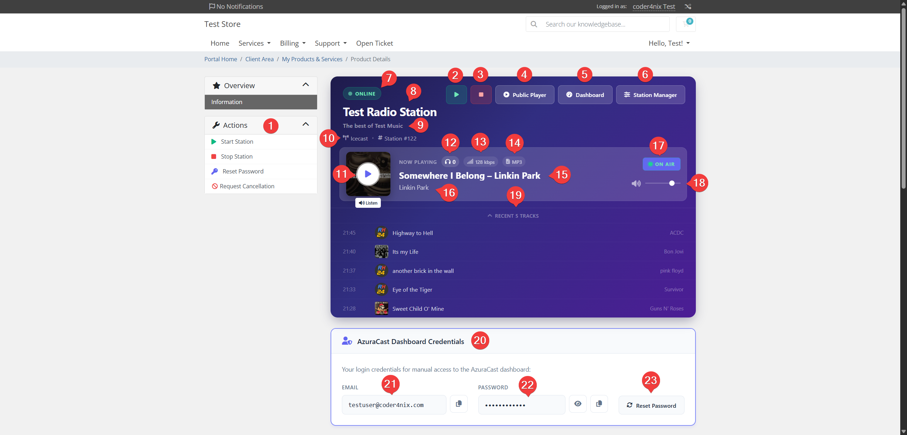
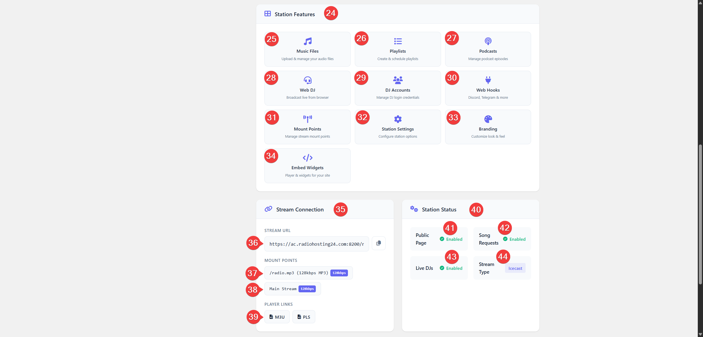
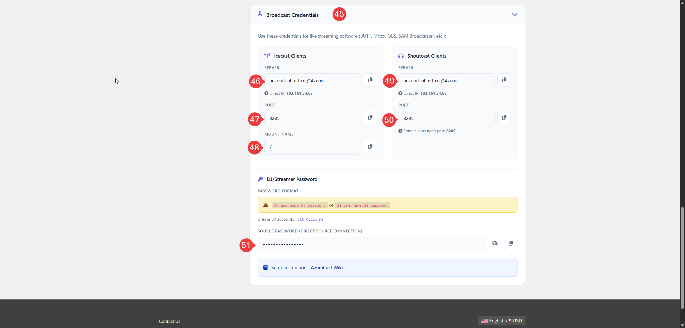
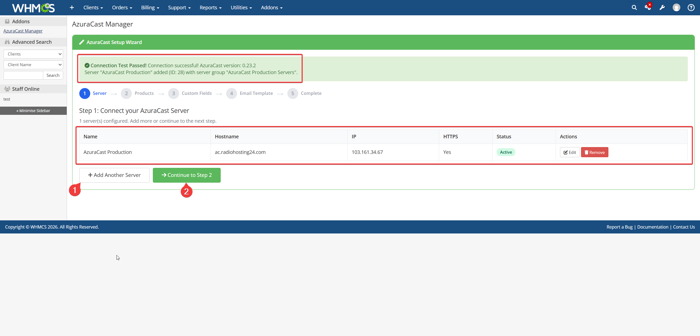
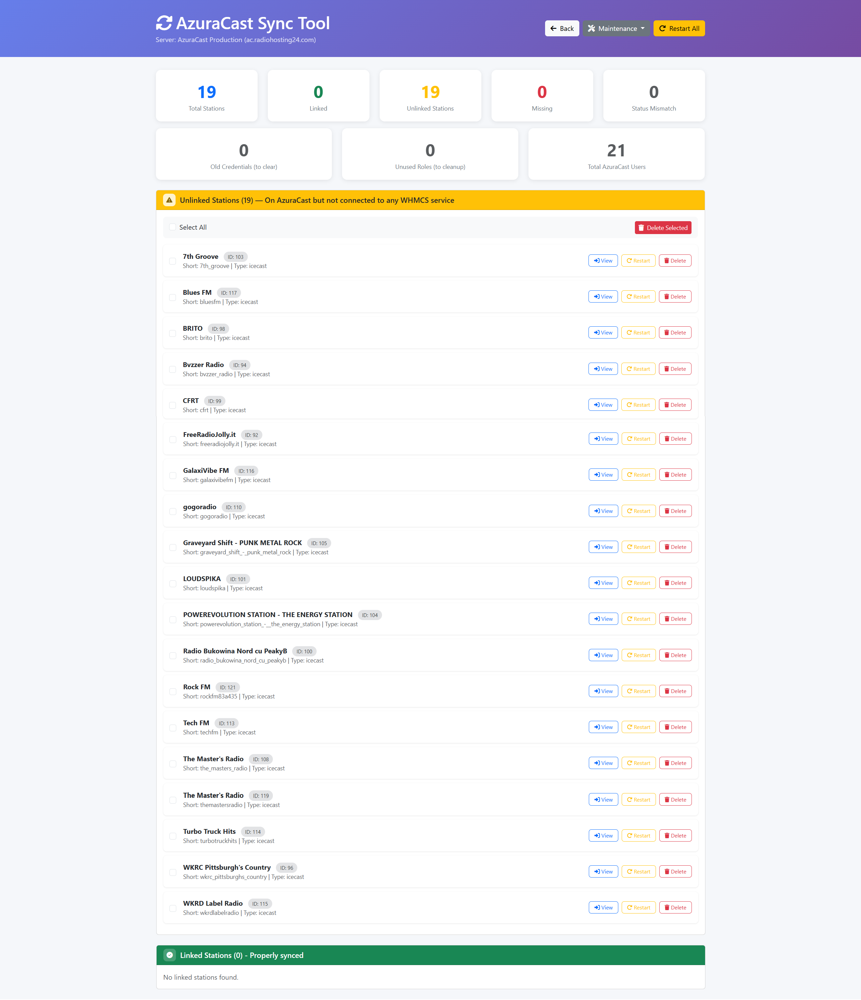

<p align="center">
  
  
  
  
  
</p>

<h1 align="center">AzuraCast Provisioning WHMCS Module</h1>

<p align="center">
  <strong>Automate your radio hosting business — from order to broadcast in seconds.</strong>
</p>

<p align="center">
  The complete automation toolkit for radio hosting providers.<br>
  Provision stations, control playback, monitor live status, and deliver SSO deep-linking — all from WHMCS.
</p>

<p align="center">
  <a href="https://coder4nix.com/azuracast.php"><strong>Product Page</strong></a> &nbsp;&bull;&nbsp;
  <a href="https://coder4nix.com/docs/"><strong>Documentation</strong></a> &nbsp;&bull;&nbsp;
  <a href="https://coder4nix.com/index.php?rp=/store/azuracast-whmcs-module"><strong>Purchase</strong></a> &nbsp;&bull;&nbsp;
  <a href="https://coder4nix.com/submitticket.php"><strong>Support</strong></a>
</p>

---

## What Is This?

The **AzuraCast WHMCS Module** is a two-component integration that bridges your WHMCS billing system with your self-hosted [AzuraCast](https://www.azuracast.com/) radio platform. It enables fully automated radio station hosting — from the moment a customer places an order to ongoing station management and termination.

**Two Components Included:**

| Component | Purpose |
|---|---|
| **Server Module** | Handles the full station lifecycle: provisioning, suspend, unsuspend, upgrade/downgrade, and terminate |
| **AzuraCast Manager Addon** | Provides a Setup Wizard, server health monitoring, station dashboard, bulk sync, and demo product creation |

---

## Key Features

### Automated Provisioning & Lifecycle

- **Instant Station Creation** — Stations, users, roles, mount points, and storage quotas are created automatically when a customer completes an order
- **Suspend / Unsuspend** — Stations are disabled or re-enabled based on invoice status
- **Upgrade / Downgrade** — Change bitrate, storage, listeners, and mounts without reprovisioning
- **Terminate** — Full cleanup: station, user, and role removal on service cancellation

### Rich Client Area

<p align="center">
  
</p>
<p align="center"><em>Hero Player with real-time status badges, Now Playing, album art, and one-click station controls</em></p>

- **Start / Stop Station** — One-click station control directly from the client area
- **Live Now Playing** — Real-time song info, album art, and listener count via Server-Sent Events (SSE)
- **Built-in Audio Player** — Stream playback with volume control, no external tools needed
- **Status Badges** — Three real-time states: Streaming, Idle, Offline
- **Recent Track History** — Last 5 played tracks with title, artist, and timestamp
- **Password Reset** — Customers can reset their AzuraCast password from the client portal

### SSO Deep-Linking (10 Feature Buttons)

<p align="center">
  
</p>
<p align="center"><em>One-click SSO access to every AzuraCast feature — no separate login required</em></p>

Customers get direct, authenticated access to their AzuraCast station panel:

| | | |
|---|---|---|
| Music Files | Playlists | Podcasts |
| Web DJ | DJ Accounts | Webhooks |
| Mount Points | Station Settings | Branding |
| Embed Widgets | | |

### Broadcast Credentials

<p align="center">
  
</p>
<p align="center"><em>Ready-to-use connection details for Icecast & Shoutcast clients (BUTT, Mixxx, OBS, SAM Broadcaster, etc.)</em></p>

- Stream URL with copy-to-clipboard
- Mount point details with bitrate badges
- Icecast & Shoutcast connection formats side-by-side
- Source password with show/hide toggle
- M3U and PLS player links

### 5-Step Setup Wizard

<p align="center">
  
</p>
<p align="center"><em>Guided setup: connect your AzuraCast server, create products, configure fields, and go live in minutes</em></p>

| Step | What It Does |
|---|---|
| 1. Server | Connect your AzuraCast server, verify API access |
| 2. Products | Create 4 pre-built hosting plans (Starter, Basic, Pro, Enterprise) |
| 3. Custom Fields | Auto-generate all 14 required custom fields per product |
| 4. Email Template | Create the "Station Credentials" welcome email with merge fields |
| 5. Complete | Summary and verification — you're ready to sell |

### Sync Tool

<p align="center">
  
</p>
<p align="center"><em>Detect and fix discrepancies between WHMCS and AzuraCast with one-click actions</em></p>

- Compare all AzuraCast stations against WHMCS services
- Identify unlinked stations, missing references, and status mismatches
- Bulk maintenance: credential cleanup, role removal, suspend sync
- Background cron sync for stream URLs, listener counts, and Now Playing data

---

## 12 Configurable Product Options

Every hosting plan is fully customizable via WHMCS Configurable Options:

| # | Option | Description | Default |
|:---:|---|---|:---:|
| 1 | Station Prefix | Prefix for auto-generated station names | `Station` |
| 2 | Default Bitrate | Stream bitrate (64–320 kbps) | `128` |
| 3 | Stream Type | Icecast or Shoutcast | `Icecast` |
| 4 | Max Listeners | Maximum concurrent listeners | `32` |
| 5 | AutoDJ | Automatic playback via Liquidsoap | Yes |
| 6 | Max Mounts | Maximum mount points | `1` |
| 7 | Public Page | Enable public player page | Yes |
| 8 | Media Storage | Media storage quota (GB) | `5` |
| 9 | Live DJs | Allow live DJ/streamer connections | No |
| 10 | Podcast Storage | Podcast storage quota (GB) | `0` |
| 11 | Song Requests | Allow listener song requests | Yes |
| 12 | Recording Storage | Recording storage quota (GB) | `0` |

---

## How It Works

```
┌──────────────┐         ┌─────────────────────┐         ┌──────────────────┐
│              │         │                     │         │                  │
│    WHMCS     │────────▶│   AzuraCast WHMCS   │────────▶│    AzuraCast     │
│   (Billing)  │         │      Module         │         │    (Stations)    │
│              │◀────────│                     │◀────────│                  │
└──────────────┘         └─────────────────────┘         └──────────────────┘
  Orders & Invoices        Provisioning Engine             REST API
```

1. **Install & Connect** — Upload the module, activate the addon, and run the Setup Wizard. It connects your AzuraCast server, verifies the API, and creates ready-to-sell products — all in minutes.

2. **Customize Plans** — The Setup Wizard creates demo products automatically. Adjust bitrate, max listeners, storage quotas, mount points, AutoDJ, and pricing to match your hosting offer.

3. **Sell & Deliver** — Customers order a plan, the station goes live instantly. They get a full self-service portal with Now Playing, Start/Stop controls, SSO deep-links, broadcast credentials, and real-time status monitoring.

---

## Email Merge Fields

The module provides 10 custom merge fields for your welcome email template:

| Merge Field | Description |
|---|---|
| `{$azuracast_station_name}` | Station name |
| `{$azuracast_station_id}` | AzuraCast station ID |
| `{$azuracast_login_url}` | AzuraCast panel URL |
| `{$azuracast_email}` | AzuraCast login email |
| `{$azuracast_password}` | AzuraCast password (decrypted) |
| `{$azuracast_source_password}` | Source/DJ password (decrypted) |
| `{$azuracast_admin_password}` | Admin password (decrypted) |
| `{$azuracast_stream_url}` | Stream URL |
| `{$azuracast_public_url}` | Public page URL |
| `{$azuracast_portal_url}` | Client portal URL |

---

## Security

- AES-encrypted passwords stored in WHMCS custom fields
- CSRF protection on all admin operations
- XSS escaping throughout the client area
- SSL/TLS API communication
- Role-based access control with 14 granular permissions
- API keys sanitized from all log output
- Admin passwords hidden from client view
- IonCube-encoded with full obfuscation
- JWT RSA-2048 license verification

---

## System Requirements

| Requirement | Version |
|---|---|
| WHMCS | 8.0 or later |
| PHP | 8.1 — 8.4 |
| IonCube Loader | 15.0+ |
| AzuraCast | 0.19+ (self-hosted, Docker or Ansible) |
| OpenSSL | Required for JWT verification |
| HTTPS | Required for API communication |

---

## Pricing

| Plan | Price | Savings |
|---|---|---|
| Monthly | €24.99 /month | — |
| Semi-Annual | €142.44 /6 months | Save 5% |
| Annual | €269.89 /year | Save 10% |

All plans include both components (Server Module + Addon), all features, and access to updates.

<p align="center">
  <a href="https://coder4nix.com/index.php?rp=/store/azuracast-whmcs-module">
    
  </a>
</p>

---

## Links

| | |
|---|---|
| Product Page | [coder4nix.com/azuracast.php](https://coder4nix.com/azuracast.php) |
| Documentation | [coder4nix.com/docs](https://coder4nix.com/docs/) |
| Purchase | [coder4nix.com/store](https://coder4nix.com/index.php?rp=/store/azuracast-whmcs-module) |
| Support | [coder4nix.com/submitticket](https://coder4nix.com/submitticket.php) |
| AzuraCast | [azuracast.com](https://www.azuracast.com/) |
| WHMCS | [whmcs.com](https://www.whmcs.com/) |

---

## License

This is a **commercial, proprietary module**. All PHP files are IonCube-encoded. A valid license key is required for operation.

This repository serves as the public product page and documentation reference. The module source code is not included here.

---

<p align="center">
  <strong>Built by <a href="https://coder4nix.com">Coder4Nix</a></strong><br>
  A subsidiary of VIRTUAL NETWORKS LTD — London, United Kingdom
</p>
